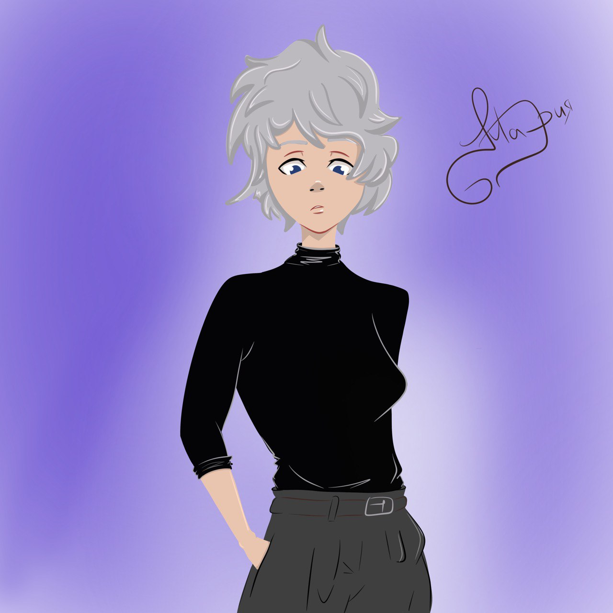
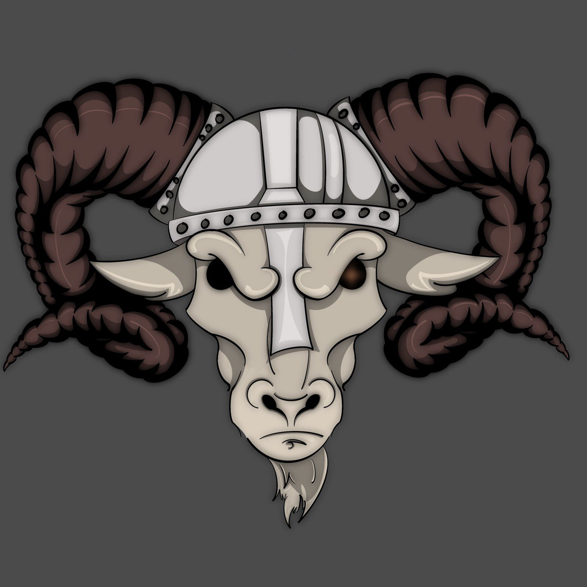
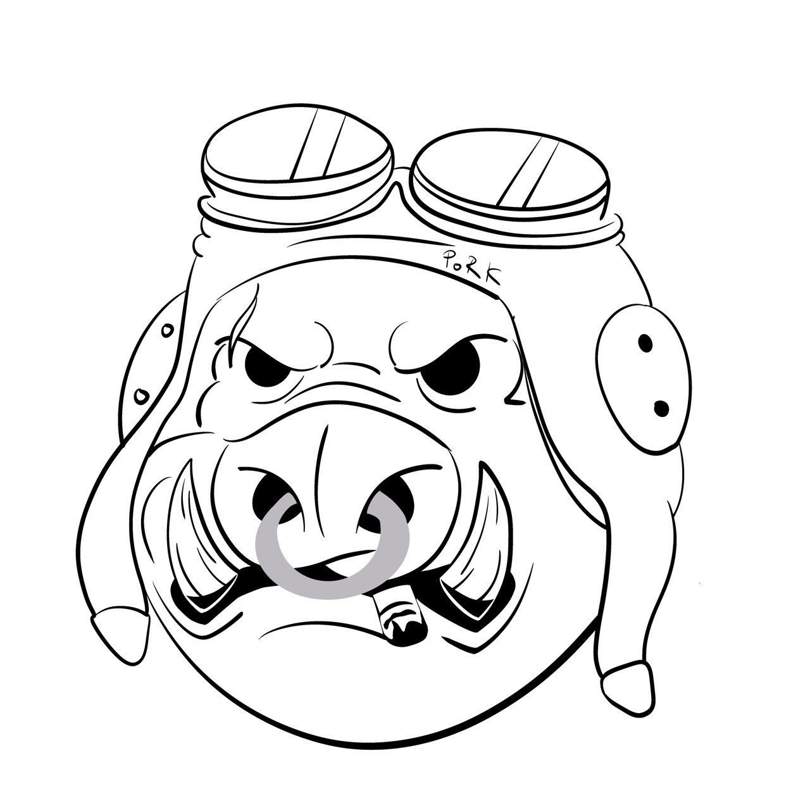

<link rel="stylesheet" href="style mari.css">
</head>
<body>

    <a href="Gallery.html" target="_blank">Gallery</a>

    <a href="Orders.html" target="_blank">Orders</a>

    <a href="Masha's home page.html" target="_blank">Home</a>

    
    

    here must be my AD

    

    <h2>Связаться со мной:</h2>
    <form action="/">
    

    <label for="name">Введите ваше имя...:</label>
    <input type="text" id="name" placeholder="Enter your name, please.">

    <label for="email">Введите ваш E-mail:</label>
    <input type="text" id="email" placeholder="Enter your E-mail, please.">

    <label for="text"> Введите ваше сообщение:</label>
         
    <textarea id="text" cols="100" rows="20"></textarea>

    <input type="submit" value="Submit">
    </form>
</body>
</html>
body {
    padding: auto;
    background-color: azure;
}
.thematic_bar {
    float: left;
    max-width: 90%;
    width: 90%;
    padding: 5px;
    margin: 50px;
    border-radius: 30px;
    box-shadow: 5px 5px 5px 5px rgb(192, 196, 252, 60%);
}
.AD {
    float: left;
    max-width: 90%;
    width: 90%;
    border-radius: 15px;
    box-shadow: 5px 5px 5px 5px rgb(192, 196, 252, 60%);
    margin: 50px 50px 50px 50px;
    padding: 5px;
}
.card {
    float: left;
    max-width: 90%;
    width: 90%;
    padding: 5px;
    margin: 50px;
    border-radius: 15px;
    box-shadow: 5px 5px 5px 5px rgb(192, 196, 252, 60%);
}
a {
    color:black;
    text-decoration: none;
}
a:hover {
    text-decoration: underline;
}
a:active {
    color:rgb(116, 38, 179);
}
a:visited {
    color:grey;
}
.link-list {
float: left;
    list-style: square;
    padding: 10px;
    padding-bottom: 10px;
}
.contacts h2 {
    text-align: center

}
.contact-card label{
display: block;
font-size: 14px;
}

@media screen and (max-width: 1440px) {

.avatara {
    float: left;
    margin: 20px 550px 20px 20px;
    max-width: 250px;
    max-height: 250px;
    border-radius: 40px;
    box-shadow: 5px 20px 20px 5px rgb(192, 196, 252, 80%);
}

.container_buttons a {
    font-size: 26px;
    float: left;
    text-align: center;
    max-width: 290px;
    max-height: 250px;
    margin: 20px 50px 20px 50px;
    padding: 10px;
    border-radius: 30px;
    box-shadow: 5px 5px 5px 5px rgb(192, 196, 252, 60%);
}

.thematic_bar img {
    float: left;
    max-width: 45%;
    margin: 32px;
    
}
.AD {
    font-size: 26px;
}
}

@media screen and (max-width: 1024px) {

.avatara {
    float: left;
    margin: 20px 350px 20px 20px;
    max-width: 150px;
    max-height: 150px;
    border-radius: 40px;
    box-shadow: 5px 20px 20px 5px rgb(192, 196, 252, 80%);
}

.container_buttons a {
    font-size: 16px;
    float: left;
    text-align: center;
    max-width: 190px;
    max-height: 150px;
    margin: 20px 50px 20px 50px;
    padding: 5px;
    border-radius: 30px;
    box-shadow: 5px 5px 5px 5px rgb(192, 196, 252, 60%);
}
.thematic_bar img {
    float: left;
    max-width: 45%;
    margin: 22px;
    
}
.AD {
    font-size: 16px;
}
}

@media screen and (max-width: 768px) {

    body {
        padding: auto;
        background-color: azure;
    }
    
    .avatara {
        float: left;
        margin: 20px 200px 20px 20px;
        max-width: 90px;
        max-height: 90px;
        border-radius: 40px;
        box-shadow: 5px 20px 20px 5px rgb(192, 196, 252, 80%);
    }
    
    .container_buttons a {
        font-size: 16px;
        float: left;
        text-align: center;
        max-width: 190px;
        max-height: 150px;
        margin: 20px 50px 20px 50px;
        padding: 5px;
        border-radius: 30px;
        box-shadow: 5px 5px 5px 5px rgb(192, 196, 252, 60%);
    }
    .thematic_bar {
        float: left;
        max-width: 90%;
        width: 90%;
        padding: 5px;
        margin: 50px;
        border-radius: 30px;
        box-shadow: 5px 5px 5px 5px rgb(192, 196, 252, 60%);
    }
    .thematic_bar img {
        float: left;
        max-width: 45%;
        margin: 22px;
        
    }
    .AD {
        font-size: 16px;
    }
}
            /*!!!ВНИМАНИЕ!!!*/
@media screen and (max-width: 576px) {
    
}
